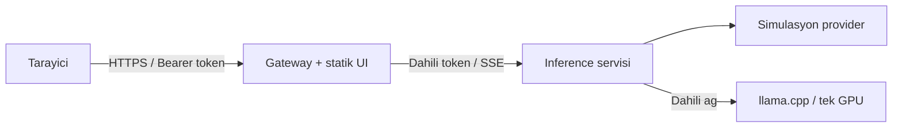

# Yerel Sohbet

Tek GPU'lu tek sunucu denemeleri icin moduler sohbet asistani. Web arayuzu ve API gecidi `gateway`, model secimi ve cikti uretimi `inference` servisindedir. Tarayici llama.cpp'ye hicbir zaman dogrudan baglanmaz.

## Baslat

Python ortaminda yerel olarak kurup simule modda calistirmak icin:

```sh
sh install.sh
sh run.sh
```

`run.sh`, varsa `.env` dosyasini yukler. `CHATBOT_API_TOKEN` bos veya yoksa `MODEL_PROVIDER` degeri ne olursa olsun `simulation` kullanilir; UI token istemez ve ayni-origin isteklerini kabul eder. Gercek llama.cpp icin `.env` icine token ve `MODEL_PROVIDER=llamacpp` yazin; UI tokeni `HttpOnly; SameSite=Strict` cookie ile arka planda dogrular. Yerel veri `data/chatbot.db` icinde kalir. Port veya bind adresini degistirmek icin `PORT=9000 HOST=127.0.0.1 sh run.sh` kullanabilirsiniz. Python 3.10+ gerekir. Baslangic icin `.env.example` dosyasini `.env` olarak kullanin.

Docker Compose ile simule modu calistirin:

```sh
export CHATBOT_API_TOKEN="deneme-icin-uzun-bir-token"
export INFERENCE_SERVICE_TOKEN="servisler-arasi-farkli-bir-token"
export POSTGRES_PASSWORD="yerel-deneme-icin-farkli-bir-parola"
docker compose up --build
```

Arayuz: http://localhost:8000

Simule mod, GPU veya model dosyasi olmadan UI/API akisini denemek icindir. Gercek model icin NVIDIA Container Toolkit, tek GPU ve uyumlu bir GGUF dosyasi gerekir. Sunucu tarafindaki llama.cpp icin ayri `.env.gpu` ayar dosyasi hazirlayin:

```sh
cp .env.gpu.example .env.gpu
# .env.gpu icindeki uc token/parola degerini duzenleyin ve MODEL_FILE'i ayarlayin.
docker compose --env-file .env.gpu -f compose.yaml -f compose.gpu.yaml up --build
```

GGUF dosyasini `MODEL_DIR` altina koyun. GPU overlay inference provider'ini zorunlu olarak `llamacpp` yapar; llama.cpp CUDA server modeli inference servisinin ozel Compose aginda sunar. llama.cpp portu host'a yayinlanmaz ve tarayicidan erisilemez. `CONTEXT_SIZE` ve `GPU_LAYERS` `.env.gpu` icinden ayarlanabilir. Model dosyasi, VRAM ve NVIDIA Container Toolkit gereklidir.

`sh run.sh` yerel Python servislerini baslatir; `MODEL_PROVIDER=llamacpp` ile kullanildiginda llama.cpp sunucusu ayrica calisiyor olmalidir ve `LLAMACPP_URL` ayarlanmalidir. GPU ile butun sunucu tarafini birlikte baslatmak icin yukaridaki Compose akisini kullanin.

## Eklenen Ozellikler

- Sohbetler, mesajlar ve yuklenen belgeler SQLite'ta yerel; Compose'ta PostgreSQL'de kalici saklanir. Sohbet arama, yeniden adlandirma, silme, mesaj duzenleme, yeniden uretme ve yanit revizyon diff'i vardir.
- Model, sicaklik, top-p ve maksimum token ayarlari tarayici oturumunda saklanir. `AVAILABLE_MODELS` virgulle ayrilmis izinli model listesidir.
- TXT, Markdown ve metin iceren PDF belgeleri yuklenebilir. Arama, tek GPU'da ayri embedding modeli gerektirmemek icin yerel anahtar-kelime eslestirmesi kullanir; semantik vektor aramasi degildir.
- `/api/mcp` JSON-RPC girisi `repo_search` ve `document_search` salt okunur araclarini sunar. Repo kokunun disina cikmaz, shell calistirmaz ve dosya yazmaz.
- Gorsel gonderme yalnizca vision model ve mmproj ile acilir: `VISION_ENABLED=true`, `MODEL_FILE` ve `MM_PROJ_FILE` GGUF dosyalarini ayarlayip `docker compose -f compose.yaml -f compose.gpu.yaml -f compose.vision.yaml up --build` calistirin.
- Mikrofonla yaziya cevirme varsayilan olarak kapali. Yerel OpenAI-uyumlu transcription servisini `TRANSCRIPTION_URL` ile baglayin; gateway ses verisini bu adrese sunucu tarafindan iletir.
- Gateway dakikada token basina varsayilan 30 istekle sinirlar (`RATE_LIMIT_PER_MINUTE`). Inference tek-GPU kuyrugu varsayilan tek aktif istekle calisir; `GPU_CONCURRENCY` ve `GPU_QUEUE_TIMEOUT_SECONDS` ayarlanabilir. Toplu metrikler token korumali `/api/metrics` ucundadir.
- Birden fazla kullanici tokeni icin `CHATBOT_API_TOKENS` JSON nesnesi kullanin; anahtar token, deger sahip kimligidir. Ornegin `'{"token-a":"alice","token-b":"bob"}'`. Sohbet ve belge sorgulari sahip kimligine gore sinirlanir.

## Mimari



- Gateway dis API kimligini, girdi boyutunu ve mesaj rollerini dogrular. Inference servisine ayri bir servis tokeniyle erisir.
- Inference servisi yalnizca Compose ic aginda kalir. llama.cpp icin host portu yayinlanmaz.
- `MODEL_PROVIDER=simulation` varsayilandir; `llamacpp` secilince inference servisi OpenAI uyumlu llama.cpp endpoint'ine baglanir.
- Sohbetler SQLite/PostgreSQL veritabaninda kalici olarak saklanir.

## Guvenlik ve sinirlar

Gateway ve servis tokenlarini farkli ve guclu tutun. Tokensiz anonim oturum yalnizca simule deneme icindir; gercek model modu bearer token gerektirir. Token tabanli giris OIDC yerine gecmez; uretimde OIDC, TLS sonlandirma, dagitik rate-limit, gizli anahtar yonetimi, denetim politikasi ve GPU kaynak limitleri eklenmelidir. Yuklenen dokuman ve repo icerigi guvenilmeyen baglam olarak modele aktarilir. Kullanici mesajlari ve model ciktisi loglanmaz.