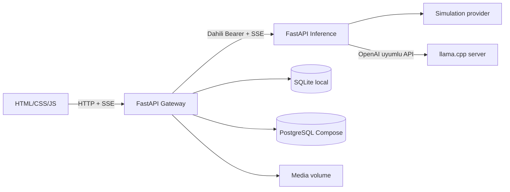

# Architecture

Bu belge calisan MVP mimarisini ve ileride ayrilabilecek sinirlari aciklar. Buradaki “microservice” ayrimi iki ayri FastAPI sureci ve yalnizca Compose ic agindan erisilen inference servisidir; gateway ve inference ayni Python dagitim imajini kullanir.

## Calisan mimari

## Sorumluluklar

- `web/`: arayuz, oturum tokeni/cookie tasima, sohbet goruntuleme ve SSE tuketme.
- `gateway/`: kullanici kimligi, rate limit, sohbet API'si, kalicilik, belge/repo aramasi, upload ve MCP HTTP girisi.
- `inference/`: dahili servis-token denetimi, tek-GPU kuyrugu, provider secimi ve llama.cpp SSE cevabinin aktarimi.
- `gateway/store.py`: SQLAlchemy modelleri ve SQLite/PostgreSQL veri erisim fonksiyonlari.
- `compose.yaml`: gateway, inference ve Postgres'i ozel bridge aginda calistirir. Gateway disari yalnizca loopback portu acar.

## Guven sinirlari

Tarayici llama.cpp'ye erisemez. Gateway'den inference'e ayrik `INFERENCE_SERVICE_TOKEN` gonderilir. Kullanici tokenlari sabit-zaman karsilastirmasiyla denetlenir; sahip kimligi tokenin kendisi degil, konfigurasyondaki owner degerinin hash'idir. Token bulunmayan anonim erisim yalnizca `UI_AUTO_AUTH=true` ve `MODEL_PROVIDER=simulation` birlikteyken acilir ve yazma isteklerinde ayni-origin kontrolu uygulanir.

Repo ve belge alintilari guvenilmeyen baglam olarak prompt'a eklenir. Repoda sadece izinli metin uzantilari okunur; shell calistirma ve dosya yazma araci yoktur.

## Simdilik bulunmayanlar

OIDC, harici event broker, vektor veritabani, dagitik rate limit, birden fazla inference node'u ve plugin discovery/kurulum servisi mevcut degildir. Ileri mimari fikirleri icin `REAL_ENGINE_STRUCTURE.md`, `EVENT_BUS.md` ve `ROADMAP.md` belgelerine bakin.